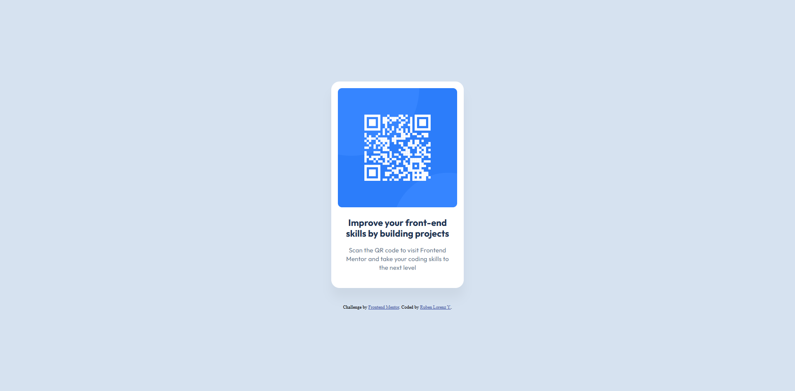
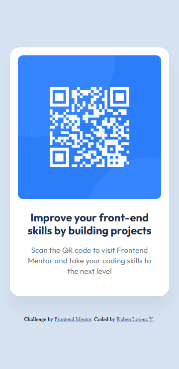

# Frontend Mentor - QR code component solution

This is a solution to the [QR code component challenge on Frontend Mentor](https://www.frontendmentor.io/challenges/qr-code-component-iux_sIO_H). Frontend Mentor challenges help you improve your coding skills by building realistic projects.

## Table of contents

- [Overview](#overview)
  - [Screenshot](#screenshot)
  - [Links](#links)
- [My process](#my-process)
  - [Built with](#built-with)
  - [What I learned](#what-i-learned)
  - [Continued development](#continued-development)

## Overview

My first Frontend Mentor challenge, I have already built websites and web-apps in the past and what led me to trying Frontend Mentor is my will to get better in the Frontend, like designing websites and using different techniques to get better and faster at building.

This challenge is really simple and I was able to dip my toes in the platform and I have already learned a lot.

### Screenshot

QR Code Component in PC


QR Code Component in Mobile


### Links

- Solution URL: [Add solution URL here](https://github.com/rulo-codes/qr-code-component)
- Live Site URL: [Add live site URL here](https://rulo-codes.github.io/qr-code-component/)

## My process

First thing I did was actually reading the README file first and just checking out the Figma file. I had to learn navigating the file and actually using it to buld the webpage.

Next, I used the :root to create CSS variables that I can use for values in the design of the website, such as font, spacing, and color.

The setup is really simple and easy. This project is easy and a way to get started with Frontend Mentor and I am excited to take more challenges.

### Built with

- Semantic HTML5 markup
- CSS custom properties
- Flexbox
- Mobile-first workflow

### What I learned

I was able to figure out how to use Figma and translate it to a web page. I learned about layers in Figma and I was able to navigate it to find out the exact px size and spacing for the elements in the design.

I found out how really powerful Figma can be and how it can make the process much faster. I would rather design the website first in Figma before building it.

Next, I was able to experiment with proper naming of :root variables in css file.

```css
:root {
  --color-white: hsl(0, 0%, 100%);
  --color-slate-300: hsl(212, 45%, 89%);
  --color-slate-500: hsl(216, 15%, 48%);
  --color-slate-900: hsl(218, 44%, 22%);
  --spacing-lg: 40px;
  --spacing-md: 24px;
  --spacing-sm: 16px;
}
```

Would be awsome to have feedback on this, I'm not really good in naming things :D.

As I stated, I am not new to Frontend or Web Development generally.

### Continued development

For the next project, I will be focusing more in accuracy and just making things efficient and very easy to maintain, by using proper variables naming and just paying attention to details and making full use of the Figma file and the style guide it comes with.

## Author

- Website - [Ruben Lorenz Y.](https://rulodev.vercel.app/)
- Frontend Mentor - [@rulo-codes](https://www.frontendmentor.io/profile/rulo-codes)
